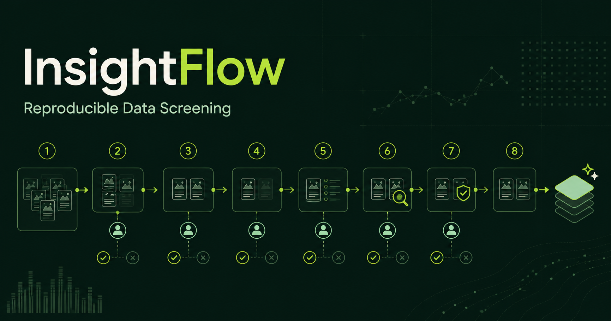

# InsightFlow

一个可复现、可审计的人机协同图像数据筛选工作台。这个仓库首先提供一个可公开体验的脱敏演示版，用于展示研究工作流、人工决策与单图证据链；后续可在同一界面接入真实模型和私有数据。

[在线体验 InsightFlow](https://insightflow-research.wuyixuan003.chatgpt.site)



## 解决什么问题

传统研究脚本很难让合作者复查“某张图片为什么被保留或剔除”。InsightFlow 把筛选流程、模型输出、人工纠正和来源风险检查集中在一个产品界面中，让每个最终决策都有迹可循，也让相同配置可以被再次运行。

## 固化的筛选流程

1. 前期预处理（规则与范围筛选）
2. OpenCLIP 高召回筛选（`p >= 0.10` 才进入下一阶段）
3. GPT-5.5 单图审核
4. 人工复核并纠正 GPT 判断
5. 人工清除 GPT 残留的 poster / photograph 等非信息图
6. C2PA 来源凭证检查
7. 腾讯云 AI 图片检测，辅助人工复核
8. 形成最终 dataset

其中 OpenCLIP 阈值只用于高召回候选筛选；C2PA 与腾讯云检测只提供来源和风险线索，不自动决定图片是否属于信息图，也不自动删除数据。

## 当前公开演示版

- 八个步骤均可点击进入独立工作区，并支持浏览器前进与返回
- 自动保存当前设备上的阈值、人工判断与备注
- 三个相互独立的人工队列：GPT 纠正、残留清理、AI 图片复核
- 支持按钮和键盘快捷键 `1 / 2 / 3` 作出保留、剔除、暂不确定的决定
- 展示每张图片从预处理到最终人工结论的完整证据链
- 导出最终 dataset CSV
- 导出包含阈值、模型版本、规则与阶段顺序的复现清单 JSON
- 使用合成、脱敏案例，不包含论文私有数据或第三方图片

公开版的 OpenCLIP、GPT、C2PA 与腾讯云结果均明确标记为可复现 Demo 信号，不代表真实 API 调用。设备本地保存是公开体验能力，不是论文正式运行环境。

## 本地研究模式（第一阶段可用）

本地模式已经可以读取真实图片目录与 CSV、自动检查记录数/图片数/缺图和必要字段，创建稳定记录 ID，并真正运行数据索引预处理。任务、预处理结果与人工审核记录保存在项目旁的 `.insightflow/insightflow.db`。服务只监听本机地址，原始图片不会上传到公开站点。

```bash
npm install
npm run local
```

打开终端显示的本地网址，在“数据源与预处理”中填写：

1. 图片文件夹完整路径
2. 帖文主表 CSV 完整路径

CSV 至少需要一个稳定记录字段（`record_id` / `id` / `post_id` / `shortcode`）和一个图片路径字段（`image_path` / `file_path` / `filename` / `image` / `media_path`）。图片路径可以是相对于图片文件夹的路径。

本地模式现在可以使用独立的 OpenCLIP 环境运行 `ViT-B-32 + Logistic Regression` 分类器，逐张保存概率，并按任务创建时冻结的 `p >= 0.10` 生成真实候选集。OpenCLIP 页同时提供一个独立的“选择训练图片”入口，人工标注会保存到项目数据库，但不会自动改变当前模型或污染本次筛选结果。

首次使用模型环境：

```bash
npm run ml:setup
```

将可信的分类器放到 `.models/en_infographic_v3_balanced/infographic_classifier.pkl`；可选的 `metrics.json` 放在同一目录。首次真实运行时会下载 OpenCLIP 预训练权重。

## Prerequisites

- Node.js `>=22.13.0`

## Quick Start

```bash
npm install
npm run dev
npm run build
```

## Useful Commands

- `npm run dev`: start local development
- `npm run local`: start the local UI and Local Agent together
- `npm run agent`: start only the Local Agent on `127.0.0.1:8765`
- `npm run ml:setup`: create the isolated OpenCLIP environment
- `npm run build`: verify the vinext build output
- `npm test`: build and verify the server-rendered product shell
- `npm run db:generate`: generate Drizzle migrations after schema changes
